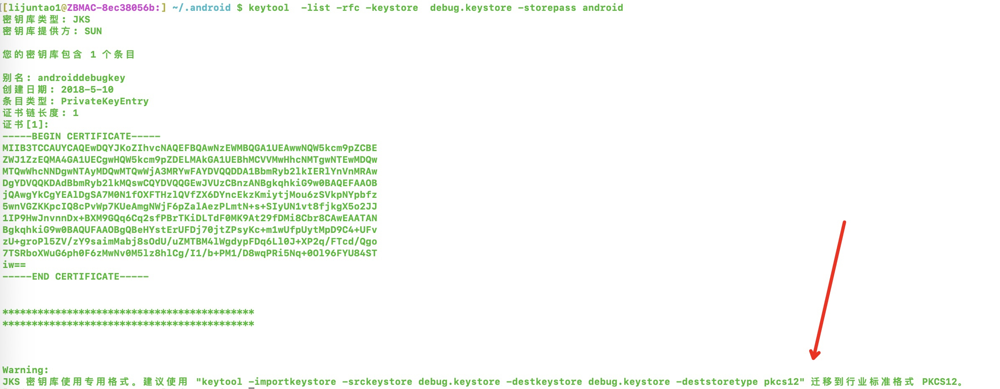
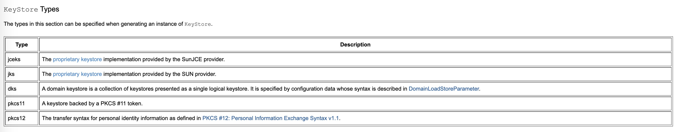

 keystore CSR CER PKCS7之间的区别与联系

 >- 对称加密：指的就是加、解密使用的同是一串密钥，所以被称做对称加密。 对称加密只有一个密钥作为私钥。 常见的对称加密算法：DES，AES等。
> - 非对称加密：指的是加、解密使用不同的密钥，一把作为公开的公钥，另一把作为私钥。


# KeyStore

在大多数情况下，当我们的应用程序需要通过SSL / TLS进行通信时，我们将使用java keystore和java truststore。

通常，这些是受密码保护的文件，与我们正在运行的应用程序位于同一文件系统上。

在Java 8之前，这些文件的默认格式为JKS(android .keystore 也是jsk格式的证书)。

从Java 9开始，默认的密钥库格式为PKCS12。

- JKS : 二进制格式，同时包含证书和私钥，一般有密码保护，只能存储非对称密钥对（私钥 + x509公钥证书）
- PKCS#12是公钥加密标准，通用格式（rsa公司标准）。微软和java 都支持。它规定了可包含所有私钥、公钥和证书。其以二进制格式存储，也称为 PFX 文件，在windows中可以直接导入到密钥区，注意，PKCS#12的密钥库保护密码同时也用于保护Key。

<font color=red>JKS和PKCS12之间的最大区别是JKS是Java专用的格式，而PKCS12是存储加密的私钥和证书的标准化且与语言无关的方式。</font>

Android签名keystore文件也是jks格式，且1.8之后要求转换到p12格式




[Java Cryptography Architecture Standard Algorithm Name Documentation for JDK 8](https://docs.oracle.com/javase/8/docs/technotes/guides/security/StandardNames.html)





JKS证书创建 XXXXXX为证书密码

```bash
keytool -genkeypair -storetype JKS -keystore test.jks -storepass XXXXXX
```

PKCS12创建方式 XXXXXX为证书密码
```bash
keytool -genkeypair -keystore myKeystore.p12 -storetype PKCS12 -storepass XXXXXX


```
查看的keystore 证书公钥命令 XXXXXX为证书密码

```bash
keytool -list -rfc -keystore HOSAnyMarvel.jks -storepass XXXXXX
```

# CSR
CSR 即证书签名申请（Certificate Signing Request），获取 SSL 证书，需要先生成 CSR 文件并提交给证书颁发机构（CA）。CSR 包含了公钥和标识名称（Distinguished Name），通常从 Web 服务器生成 CSR，同时创建加解密的公钥私钥对。

基于keystore文件创建证书请求文件csr,此处xxx需要与keystore文件中的alias保持一致

```bash
keytool -certreq -alias "xxxxx" -keystore HOSAnyMarvel.jks -file HOSAnyMarvel.csr
```

查看csr证书内容，csr为文本格式可直接打开，或使用openssl打开验证

```bash
openssl req  -text -in HOSAnyMarvel.csr
```
# CER

用于存储公钥证书的文件格式。只包含公钥信息,一般只能用于解密使用(解密该公钥对应的私钥加密的数据)。

cer一般由CSR请求CA机构颁发，或从keystore文件中导出
导出cer命令,此处xxx需要与keystore文件中的alias保持一致,基于keystore导出cer需要密码：

```bash
keytool -exportcert -alias "xxxx" -keystore HOSAnyMarvel.jks -rfc -file HOSAnyMarvel.cer -storepass 123456

```

查看cer证书内容，cer为文本格式可直接打开，或使用openssl打开验证

```bash
keytool -printcert -file AnyMarvelHOS.cer
```

# PKCS #7 (p7b)

>SignedData对象，唯一有效的字段是证书。 特别是，签名和内容将被忽略。 如果不存在证书，则假定为零长度的CertPath。

>Warning：PKCS＃7不在认证路径中维护证书的顺序。 这意味着，如果将CertPath转换为PKCS＃7编码的字节，然后再转换回去，则证书的顺序可能会更改，从而可能使CertPath无效。 用户应注意此行为。

简单理解 pkcs#7 格式文件为信封，为二进制格式，其中可以包含：证书(x509标准格式)，公钥，消息体，数字签名等信息。

<font color=red>
1. Android签名文件CERT.RSA本身为pkcs#7格式
2. 鸿蒙签名文件
</font>


pkcs7 格式的证书内容查看

```bash
openssl pkcs7 -inform DER -in AnymarvelHOSDebug.p7b  -print_certs -text
```

文本格式查看信封内部的其他内容

```bash
vim HOSAnyMarvel.p7b
:%!xxd
```
