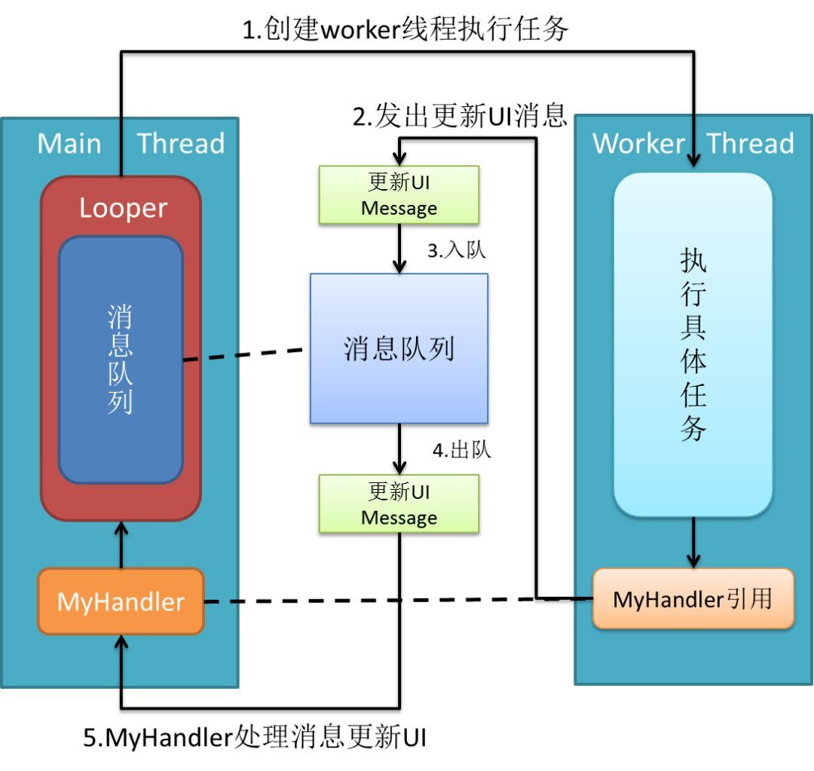

Handler 机制 源码+图+常见问题+Demo 详细记录(本文内容略长,但内容较为详细,推荐Android开发者可深入观看.如有问题,欢迎指正)

android的消息处理有三个核心类：Looper,Handler和Message。还有一个MessageQueue（消息队列,以下简称MQ），但是MQ被封装到Looper里面。

首先从ActivityThread类的Main函数开始:

```java
public static void main(String[] args) {
         ......//篇幅问题,内容已删减
         Looper.prepareMainLooper();

         // Find the value for {@link #PROC_START_SEQ_IDENT} if provided on the command line.
         // It will be in the format "seq=114"
         long startSeq = 0;
         if (args != null) {
             for (int i = args.length - 1; i >= 0; --i) {
                if (args[i] != null && args[i].startsWith(PROC_START_SEQ_IDENT)) {
                    startSeq = Long.parseLong(
                            args[i].substring(PROC_START_SEQ_IDENT.length()));
                }
            }
        }
        ActivityThread thread = new ActivityThread();
        thread.attach(false, startSeq);
        if (sMainThreadHandler == null) {
            sMainThreadHandler = thread.getHandler();
        }
        ......//篇幅问题,内容已删减
        // End of event ActivityThreadMain.
        Looper.loop();

        throw new RuntimeException("Main thread loop unexpectedly exited");
    }
```

ActivityThread main函数中的第三行 Looper.prepareMainLooper();这里看下源码内容:

```java
/**
 * Initialize the current thread as a looper, marking it as an
 * application's main looper. The main looper for your application
 * is created by the Android environment, so you should never need
 * to call this function yourself.  See also: {@link #prepare()}
 */
public static void prepareMainLooper() {
    prepare(false);//调用该方法在ThreadLocal中创建Looper对象
    synchronized (Looper.class) {
        if (sMainLooper != null) {
            throw new IllegalStateException("The main Looper has already been prepared.");
        }
        sMainLooper = myLooper();
    }
```

如上代码内容调用了prepare(false);方法.这里我们分析下handler机制中Looper的作用。


01一.  Looper

Looper的字面意思是“循环者”，它被设计用来使一个普通线程变成Looper线程。所谓Looper线程就是循环工作的线程。在程序开发中（尤其是GUI开发中），我们经常会需要一个线程不断循环，一旦有新任务则执行，执行完继续等待下一个任务，这就是Looper线程。使用Looper类创建Looper线程很简单：

```java
public class LooperThread extends Thread {
    @Override
    public void run() {
        // 将当前线程初始化为Looper线程
        Looper.prepare();

        // ...其他处理，如实例化handler

        // 开始循环处理消息队列
        Looper.loop();
    }
}
```

以上类似在ActivityThread中的使用.prepareMainLooper()中也是调用的 Looper.prepare();通过上面两行核心代码，你的线程就升级为Looper线程了！！！是不是很神奇？让我们放慢镜头，看看这两行代码各自做了什么。

1)Looper.prepare()

通过下图可以看到，现在你的线程中有一个Looper对象，它的内部维护了一个消息队列MQ。注意，**一个Thread只能有一个Looper对象**


```java
public class Looper {
     // 每个线程中的Looper对象其实是一个ThreadLocal，即线程本地存储(ThreadLocal)对象
     private static final ThreadLocal sThreadLocal = new ThreadLocal();
     // Looper内的消息队列
     final MessageQueue mQueue;
     // 当前线程
     Thread mThread;
     // 。。。其他属性

    // 每个Looper对象中有它的消息队列，和它所属的线程
    private Looper() {
        mQueue = new MessageQueue();
        mRun = true;
        mThread = Thread.currentThread();
    }

    // 我们调用该方法会在调用线程的ThreadLocal中创建Looper对象
    public static void prepare() {
        prepare(true);
    }

    private static void prepare(boolean quitAllowed) {
        if (sThreadLocal.get() != null) {
            throw new RuntimeException("Only one Looper may be created per thread");
        }
        sThreadLocal.set(new Looper(quitAllowed));
    }
   //ThreadActivity中使用,初始化UI线程为Looper线程
    public static void prepareMainLooper() {
        prepare(false);
        synchronized (Looper.class) {
            if (sMainLooper != null) {
                throw new IllegalStateException("The main Looper has already been prepared.");
            }
            sMainLooper = myLooper();
        }
    }
    // 其他方法
}
```

如果你还不清楚什么是ThreadLocal，请参考[《多线程之ThreadLocal简析》](http://blog.csdn.net/qjyong/article/details/2158097)

2）Looper.loop()

ActivityThread中也调用了Looper.loop() 1)中我们初始化先成为Looper线程.使用looper.loop()后looper线程就真的开始工作了。它不断从自己的MQ中取出队头的消息(也叫任务)执行


```java
 public static final void loop() {
         Looper me = myLooper();  //得到当前线程Looper
         MessageQueue queue = me.mQueue;  //得到当前looper的MQ

         // 清除远程Binder调用端uid和pid信息，并保存到ident变量
         Binder.clearCallingIdentity();
         final long ident = Binder.clearCallingIdentity();
         // 开始循环
         while (true) {
            Message msg = queue.next(); // 取出message
            if (msg != null) {
                if (msg.target == null) {
                    // message没有target为结束信号，退出循环
                    return;
                }
                // 日志。。。
                if (me.mLogging!= null) me.mLogging.println(
                        ">>>>> Dispatching to " + msg.target + " "
                        + msg.callback + ": " + msg.what
                        );
                // 非常重要！将真正的处理工作交给message的target，即后面要讲的handler
                msg.target.dispatchMessage(msg);
                // 还是日志。。。
                if (me.mLogging!= null) me.mLogging.println(
                        "<<<<< Finished to    " + msg.target + " "
                        + msg.callback);

                //清除远程Binder调用端uid和pid信息，并保存到newIdent变量
                final long newIdent = Binder.clearCallingIdentity();
                if (ident != newIdent) {
                    Log.wtf("Looper", "Thread identity changed from 0x"
                            + Long.toHexString(ident) + " to 0x"
                            + Long.toHexString(newIdent) + " while dispatching to "
                            + msg.target.getClass().getName() + " "
                            + msg.callback + " what=" + msg.what);
                }
                // 回收message资源
                msg.recycle();
            }
        }
    }
```

这里我们看到，mLooper()方法里我们取出了当前线程的looper对象，然后从looper对象开启了一个死循环 

不断地从looper内的MessageQueue中取出Message，只要有Message对象，就会通过Message的target调用

dispatchMessage去分发消息，通过代码可以看出target就是我们创建的handler。Message的分发调用dispatchMessage(msg)方法,接下分析Handler中我们会提到。

除了prepare()和loop()方法，Looper类还提供了一些有用的方法

```java
 //Looper.myLooper()得到当前线程looper对象
 public static final Looper myLooper() {
         // 在任意线程调用Looper.myLooper()返回的都是那个线程的looper
         return (Looper)sThreadLocal.get();
     }
 //getThread()得到looper对象所属线程
 public Thread getThread() {
         return mThread;
     }
//quit()方法结束looper循环
public void quit() {
        // 创建一个空的message，它的target为NULL，表示结束循环消息
        Message msg = Message.obtain();
        // 发出消息
        mQueue.enqueueMessage(msg, 0);
    }
```

上述的注释写的很清楚,

Looper总结:

1.  每个线程有且最多只能有一个Looper对象，它是一个ThreadLocal对象

2.  Looper内部有一个消息队列，loop()方法调用后线程开始不断从队列中取出消息执行

3.  Looper使一个线程变成Looper线程。

大家可能注意到Looper.loop()方法中第22行msg.target.dispatchMessage(msg);上文中的注释提到是用于消息分发,处理Message。如何向往MQ上添加消息和处理消息是Handler的职责。下面介绍异步大师handler


02二. Handler

什么是handler？简单来说:handler扮演了往MQ上添加消息和处理消息的角色（只处理由自己发出的消息），即通知MQ它要执行一个任务(sendMessage)，并在loop到自己的时候执行该任务(handleMessage)，整个过程是异步的。handler创建时会关联一个looper，默认的构造方法将关联当前线程的looper，不过这也是可以set的。构造方法如下：

```java
 public class handler {

     final MessageQueue mQueue;  // 关联的MQ
     final Looper mLooper;  // 关联的looper
     final Callback mCallback;
     // 其他属性

     public Handler() {
         this(null, false);
    }
    public Handler(Callback callback) {
        this(callback, false);
    }

    public Handler(Looper looper) {
        this(looper, null, false);
    }

    public Handler(Looper looper, Callback callback) {
        this(looper, callback, false);
    }
    /**
     * Use the {@link Looper} for the current thread with the specified callback interface
     * and set whether the handler should be asynchronous.
     *
     * Handlers are synchronous by default unless this constructor is used to make
     * one that is strictly asynchronous.
     *
     * Asynchronous messages represent interrupts or events that do not require global ordering
     * with respect to synchronous messages.  Asynchronous messages are not subject to
     * the synchronization barriers introduced by {@link MessageQueue#enqueueSyncBarrier(long)}.
     *
     * @param callback The callback interface in which to handle messages, or null.
     * @param async If true, the handler calls {@link Message#setAsynchronous(boolean)} for
     * each {@link Message} that is sent to it or {@link Runnable} that is posted to it.
     *
     * @hide
     */
    public Handler(Callback callback, boolean async) {
        if (FIND_POTENTIAL_LEAKS) {
            final Class<? extends Handler> klass = getClass();
            if ((klass.isAnonymousClass() || klass.isMemberClass() || klass.isLocalClass()) &&
                    (klass.getModifiers() & Modifier.STATIC) == 0) {
                Log.w(TAG, "The following Handler class should be static or leaks might occur: " +
                    klass.getCanonicalName());
            }
        }
        // 默认将关联当前线程的looper
        mLooper = Looper.myLooper();
        // looper不能为空，即该默认的构造方法只能在looper线程中使用
        if (mLooper == null) {
            throw new RuntimeException(
                "Can't create handler inside thread " + Thread.currentThread()
                        + " that has not called Looper.prepare()");
        }
        // 重要！！！直接把关联looper的MQ作为自己的MQ，因此它的消息将发送到关联looper的MQ上
        mQueue = mLooper.mQueue;
        mCallback = callback;
        mAsynchronous = async;
    }
    /**
     * Use the provided {@link Looper} instead of the default one and take a callback
     * interface in which to handle messages.  Also set whether the handler
     * should be asynchronous.
     *
     * Handlers are synchronous by default unless this constructor is used to make
     * one that is strictly asynchronous.
     *
     * Asynchronous messages represent interrupts or events that do not require global ordering
     * with respect to synchronous messages.  Asynchronous messages are not subject to
     * the synchronization barriers introduced by conditions such as display vsync.
     *
     * @param looper The looper, must not be null.
     * @param callback The callback interface in which to handle messages, or null.
     * @param async If true, the handler calls {@link Message#setAsynchronous(boolean)} for
     * each {@link Message} that is sent to it or {@link Runnable} that is posted to it.
     *
     * @hide
     */
    public Handler(Looper looper, Callback callback, boolean async) {
        mLooper = looper;
        mQueue = looper.mQueue;
        mCallback = callback;
        mAsynchronous = async;
    }
}
```

Handler提供了多种构造方法,默认的构造方法中Looper默认关联当前线程,把关联Looper的MQ作为自己的MQ。三个参数的构造方法中需要传入Looper对象,Callback接口(这里简要提下)

```java
/**
     * Callback interface you can use when instantiating a Handler to avoid
     * having to implement your own subclass of Handler.
     */
    //意思大概就是使用这个接口可以避免自己去写一个Handler的子类
    public interface Callback {
        /**
         * @param msg A {@link android.os.Message Message} object
         * @return True if no further handling is desired
         */
        public boolean handleMessage(Message msg);
    }
```

在使用Handler时如果直接使用匿名内部类的方式创建Handler对象ide会发出警告，提示内存泄漏风险。这时可以通过创建继承Handler的静态内部类或使用弱引用来避免Handler对象持有外部类对象的强引用。但是官方还提供了一个Handler.Callback接口。

注意:handler会持有匿名对象的引用，匿名对象会持有外部类对象的引用，虽然ide不再警告但是内存泄漏问题并没有解决。所以要在onDestroy方法中调用handler.removeCallbacksAndMessages(null); 来清空消息。或者用弱引用,如下所示,具体使用可见Demo：

```java
        Handler handler = new Handler(new WeakReference<Handler.Callback>(new Handler.Callback() {
            @Override
            public boolean handleMessage(Message msg) {
                return false;
            }
        }).get());
```

接下来继续Handler,我们把一)中的Looper线程加入Handler

```java
public class LooperThread extends Thread {
     private Handler handler1;
     private Handler handler2;

     @Override
     public void run() {
         // 将当前线程初始化为Looper线程
         Looper.prepare();

        // 实例化两个handler
        handler1 = new Handler();
        handler2 = new Handler();

        // 开始循环处理消息队列
        Looper.loop();
    }
}
```

加入handler后的效果如下图：


可以看到，**一个线程可以有多个Handler，但是只能有一个Looper(ThreadLocal对象)！**

Handler发送消息

有了handler之后，我们就可以使用 post(Runnable), postAtTime(Runnable, long),postDelayed(Runnable,long), sendEmptyMessage(int), sendMessage(Message),sendMessageAtTime(Message,long)和sendMessageDelayed(Message, long)这些方法向MQ上发送消息了。光看这些API你可能会觉得handler能发两种消息，一种是Runnable对象，一种是message对象，这是直观的理解，但其实post发出的Runnable对象最后都被封装成message对象了，见源码：

```java
 // 此方法用于向关联的MQ上发送Runnable对象，它的run方法将在handler关联的looper线程中执行
     public final boolean post(Runnable r)
     {
        // 注意getPostMessage(r)将runnable封装成message
        return  sendMessageDelayed(getPostMessage(r), 0);
     }

     private final Message getPostMessage(Runnable r) {
         Message m = Message.obtain();  //得到空的message
        m.callback = r;  //将runnable设为message的callback，
        return m;
    }

    public boolean sendMessageAtTime(Message msg, long uptimeMillis)
    {
        boolean sent = false;
        MessageQueue queue = mQueue;
        if (queue != null) {
            msg.target = this;  // message的target必须设为该handler！
            sent = queue.enqueueMessage(msg, uptimeMillis);
        }
        else {
            RuntimeException e = new RuntimeException(
                this + " sendMessageAtTime() called with no mQueue");
            Log.w("Looper", e.getMessage(), e);
        }
        return sent;
    }
```

其他方法就不罗列了，总之通过handler发出的message有如下特点：

1.message.target为该handler对象，这确保了looper执行到该message时能找到处理它的handler，即loop()方法中的关键代码,即上文中提到的Message分发:

```java
msg.target.dispatchMessage(msg);
```

2.post发出的message，其callback为Runnable对象

Handler处理消息

说完了消息的发送，再来看下handler如何处理消息。消息的处理是通过核心方法[dispatchMessage](http://developer.android.com/reference/android/os/Handler.html#dispatchMessage%28android.os.Message%29)([Message](http://developer.android.com/reference/android/os/Message.html) msg)与钩子方法[handleMessage](http://developer.android.com/reference/android/os/Handler.html#handleMessage%28android.os.Message%29)([Message](http://developer.android.com/reference/android/os/Message.html) msg)完成的，见源码:

```java
// 处理消息，该方法由looper调用
     public void dispatchMessage(Message msg) {
         if (msg.callback != null) {
             // 如果message设置了callback，即runnable消息，处理callback！
             handleCallback(msg);
         } else {
             // 如果handler本身设置了callback，则执行callback
             if (mCallback != null) {
                  /* 这种方法允许让activity等来实现Handler.Callback接口，避免了自己编写handler重写handleMessage方法。见http://alex-yang-xiansoftware-com.iteye.com/blog/850865 */
                if (mCallback.handleMessage(msg)) {
                    return;
                }
            }
            // 如果message没有callback，则调用handler的钩子方法handleMessage
            handleMessage(msg);
        }
    }

    // 处理runnable消息
    private final void handleCallback(Message message) {
        message.callback.run();  //直接调用run方法！
    }
    // 由子类实现的钩子方法
    public void handleMessage(Message msg) {
```

dispatchMessage(Message msg)方法为Public提供给Looper进行消息传递,这里一般情况下不需要重写,目前也没见到过重写场景,如有,请指教...

可以看到，除了[handleMessage](http://developer.android.com/reference/android/os/Handler.html#handleMessage%28android.os.Message%29)([Message](http://developer.android.com/reference/android/os/Message.html) msg)和Runnable对象的run方法由开发者实现外（实现具体逻辑），handler的内部工作机制对开发者是透明的。这正是handler API设计的精妙之处！

Handler的用处

Android异步任务处理大师Handler拥有下面两个重要的特点:

1\. handler可以在任意线程发送消息，这些消息会被添加到关联的MQ上。


2\. handler是在它**关联的looper线程中处理消息**的。


这就解决了android最经典的不能在其他非主线程中更新UI的问题。**android的主线程也是一个looper线程**(looper在android中运用很广)，我们在其中创建的handler默认将关联主线程MQ。因此，利用handler的一个solution就是在activity中创建handler并将其引用传递给worker thread，worker thread执行完任务后使用handler发送消息通知activity更新UI。(过程如图)



具体Demo及Handler使用方法请移步:github(同性交友社区):

[https://github.com/AnyMarvel/HandlerDemo](https://github.com/AnyMarvel/HandlerDemo)

WorkDemo Activity工作内容如下:

```java
 public class HandlerWorkDemo extends AppCompatActivity {
     TextView textView;

     @Override
     protected void onCreate(@Nullable Bundle savedInstanceState) {
         super.onCreate(savedInstanceState);
         setContentView(R.layout.handler_work);
         textView = findViewById(R.id.workText);
         // 创建并启动工作线程
        Thread workerThread = new Thread(new SampleTask(new MyHandler()));
        workerThread.start();
    }

    public void appendText(String msg) {
        textView.setText(textView.getText() + "\n" + msg);
    }
    //内部类,实现MyHandler
    class MyHandler extends Handler {

        @Override
        public void handleMessage(Message msg) {
            super.handleMessage(msg);
            String result = msg.getData().getString("message");
            // 更新UI
            appendText(result);

        }
    }

    private class SampleTask implements Runnable {
        private Handler handler;

        public SampleTask(MyHandler myHandler) {
            this.handler = myHandler;
        }

        @Override
        public void run() {
            try {  // 模拟执行某项任务，下载等
                Thread.sleep(5000);
                // 任务完成后通知activity更新UI
                Message msg = prepareMessage("task completed!");
                // message将被添加到主线程的MQ中
                handler.sendMessage(msg);
            } catch (InterruptedException e) {
                Log.d("SampleTask", "interrupted!");
            }

        }

        private Message prepareMessage(String str) {
            Message result = handler.obtainMessage();
            Bundle data = new Bundle();
            data.putString("message", str);
            result.setData(data);
            return result;
        }
    }
}
```

当然，handler能做的远远不仅如此，由于它能post Runnable对象，它还能与Looper配合实现经典的Pipeline Thread(流水线线程)模式。Handler作为Android异步任务大师,还有一些比较经典的用法,这里不再一一赘述,有遇到handler坑的欢迎留言


03三 .Message

对于稍有经验的开发人员来说我们在使用Handler发送异步消息获取Message的时候都会使用如下代码获取一个Message对象：

```
Message msg = mHandler.obtainMessage();
```

而不是直接new一个：

```
Message msg = new Message();
```

二者的主要区别就是上面的用到缓存池概念，如果池中有闲着的则拿来用，没有则new一个Message。后者则没有这个机制，直接new一个拿来用。

接下来我们分析一下这个缓存池是怎么实现的。

**Message缓存池源码分析**

Handler中obtainMessage()方法实质还是调用的Message中obtain()方法，这里就直接看Message中obtain()方法源码了：

```java
 //锁对象，只读不写，final修饰
     public static final Object sPoolSync = new Object();
     private static Message sPool;
     private static int sPoolSize = 0;

     private static final int MAX_POOL_SIZE = 50;

     private static boolean gCheckRecycle = true;

    /**
     * Return a new Message instance from the global pool. Allows us to
     * avoid allocating new objects in many cases.
     */
    public static Message obtain() {
        synchronized (sPoolSync) {
            //判断sPool是否为空,为空则New&nbsp;Message对象,不为空则获取缓存中的Message对象
            if (sPool != null) {
               //单链表的结构，将sPool指向当前Message，Message的next指向下一个Message。
                Message m = sPool;
                sPool = m.next;
                m.next = null;
                m.flags = 0; // clear in-use flag
                sPoolSize--;
                return m;
            }
        }
        return new Message();
    }
```

代码很简单，给sPoolSync加锁后，判断sPool是否为null，不为null则将sPool引用指向一个新的Message，并将新的Message的next的引用指向sPool，随即将next置空，标记重置，sPoolSize--，返回一个Message；如果sPool为null的话，直接new出一个Message。

obtain()主要逻辑就是先判断缓存池中是否存在空闲message，如果存在则返回头部message,并且指针指向下一个空闲message,然后头部的message与之后链表  断开连接。如果不存在空闲message则直接new一个直接返回。

上面的逻辑都是从缓存池中获取的操作，那什么时候向缓存池中存放呢？我们继续向下分析。

Message类中recycle()方法是用于回收用完的mesage，将此message会收到缓存池中，是这样的吗？我们看下源码就知道了：

```java
public void recycle() {
        if (isInUse()) {
            if (gCheckRecycle) {
                throw new IllegalStateException("This message cannot be recycled because it "
                        + "is still in use.");
            }
            return;
        }
        recycleUnchecked();
    }
```

recycle方法中主要判断当前message是否正在使用中，如果正在使用则抛出异常，没被使用则调用recycleUnchecked()方法，接下来看下recycleUnchecked()：

```java
/**
      * Recycles a Message that may be in-use.
      * Used internally by the MessageQueue and Looper when disposing of queued Messages.
      */
     void recycleUnchecked() {
         // Mark the message as in use while it remains in the recycled object pool.
         // Clear out all other details.
         flags = FLAG_IN_USE;
         what =0 ;
        arg1 =0 ;
        arg2 =0 ;
        obj = null;
        replyTo = null;
        sendingUid = -1;
        when =0 ;
        target = null;
        callback = null;
        data = null;

        synchronized (sPoolSync) {
            if (sPoolSize < MAX_POOL_SIZE) {
                next = sPool;
                sPool = this;
                sPoolSize++;
            }
        }
    }
```

判断当前缓存池sPoolSize是否小于设定的最大缓冲池大小，如果小于这个值，则将sPool指向下一个Message，当前Message指向sPool，sPoolSize++，相当于回收了这个使用过的Message。

message的用法比较简单，这里不做总结了,但需要注意以下几点:

*   1.尽管Message有public的默认构造方法，但是你应该通过Message.obtain()来从消息池中获得空消息对象，以节省资源。

*   2.如果你的message只需要携带简单的int信息，请优先使用Message.arg1和Message.arg2来传递信息，这比用Bundle更省内存

*   3.擅用message.what来标识信息，以便用不同方式处理message。

<svg width="360" height="32" xmlns="http://www.w3.org/2000/svg" style="box-sizing: border-box;"><text width="300" font-family="microsoft yahei" font-size="18" y="24" x="147.882" style="box-sizing: border-box;"><tspan class="135brush" data-brushtype="text" style="box-sizing: border-box;">恭喜看到这里，完事了</tspan></text></svg>

总结:

一. Android Handler使用流程

*   1\. 判断当前线程是否为Looper线程,否则初始化为looper线程

*   2\. 初始化handler

*   3\. 基于handler发送消息

*   4\. 基于handler处理消息

以上步骤看着很是简单,但还是出现了各种问题

二. 注意事项总结

*   1. Handler对象与其调用者在同一线程中，如果在Handler中设置了延时操作，则调用线程也会堵塞。每个Handler对象都会绑定一个Looper对象，每个Looper对象对应一个消息队列（MQ）。如果在创建Handler时不指定与其绑定的Looper对象，系统默认会将当前线程的Looper绑定到该Handler上。

*   2.在主线程中，可以直接使用new Handler()创建Handler对象，其将自动与主线程的Looper对象绑定；在非主线程中直接这样创建Handler则会报错，因为Android系统默认情况下非主线程中没有开启Looper，而Handler对象必须绑定Looper对象。这种情况下，需先在该线程中手动开启Looper（Looper.prepare()-->Looper.loop()），然后将其绑定到Handler对象上；或者通过Looper.getMainLooper()，获得主线程的Looper，将其绑定到此Handler对象上。

*   3.Handler发送的消息都会加入到Looper的MessageQueue中。一说Handler包含两个队列：线程队列和消息队列；使用Handler.post()可以将线程对象加入到线程队列中；使用Handler.sendMessage()可以将消息对象加入到消息队列中。通过源码分析证实，Handler只有一个消息队列，即MessageQueue。通过post()传进去的线程对象将会被封装成消息对象后传入MessageQueue。

*   4.使用post()将线程对象放到消息队列中后，当Looper轮询到该线程执行时，实际上并不会单独开启一个新线程，而仍然在当前Looper绑定的线程中执行，Handler只是调用了该线程对象的run()而已。如，在子线程中定义了更新UI的指令，若直接开启将该线程执行，则会报错；而通过post()将其加入到主线程的Looper中并执行，就可以实现UI的更新。

*   5.使用sendMessage()将消息对象加入到消息队列后，当Looper轮询到该消息时，就会调用Handler的handleMessage()来对其进行处理。再以更新UI为例，使用这种方法的话，就先将主线程的Looper绑定在Handler对象上，重载handleMessage()来处理UI更新，然后向其发送消息就可以了。


(完)以上是对Android Handler机制的总结,(Handler使用过程中容易造成内容溢出的问题这里没有做说明,demo中有解决方法,详情见demo,持续更新handler触发问题)

具体Demo及Handler使用方法请移步:github(同性交友社区):

[https://github.com/AnyMarvel/HandlerDemo](https://github.com/AnyMarvel/HandlerDemo)
